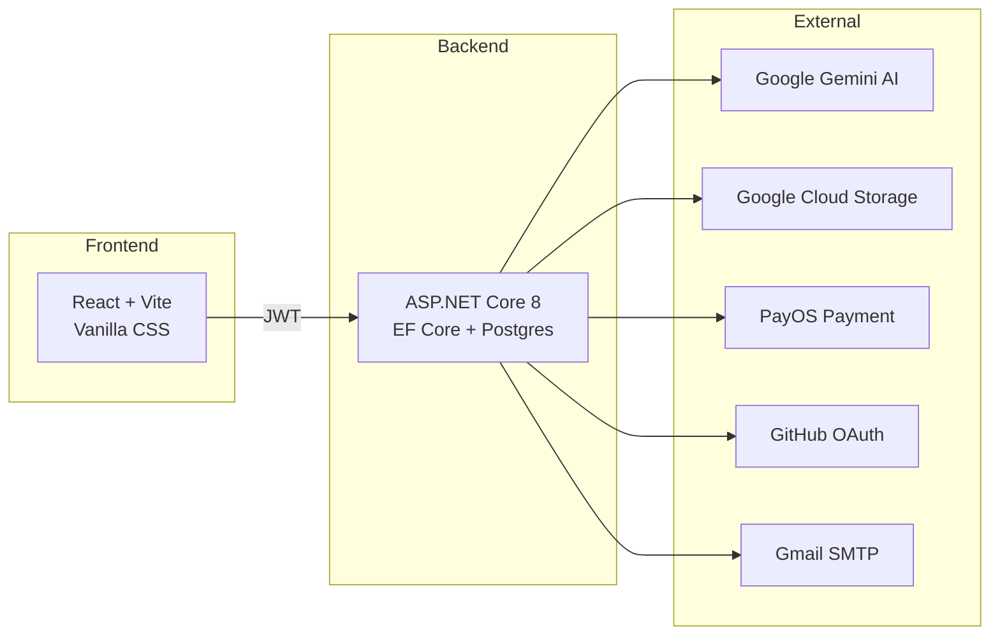
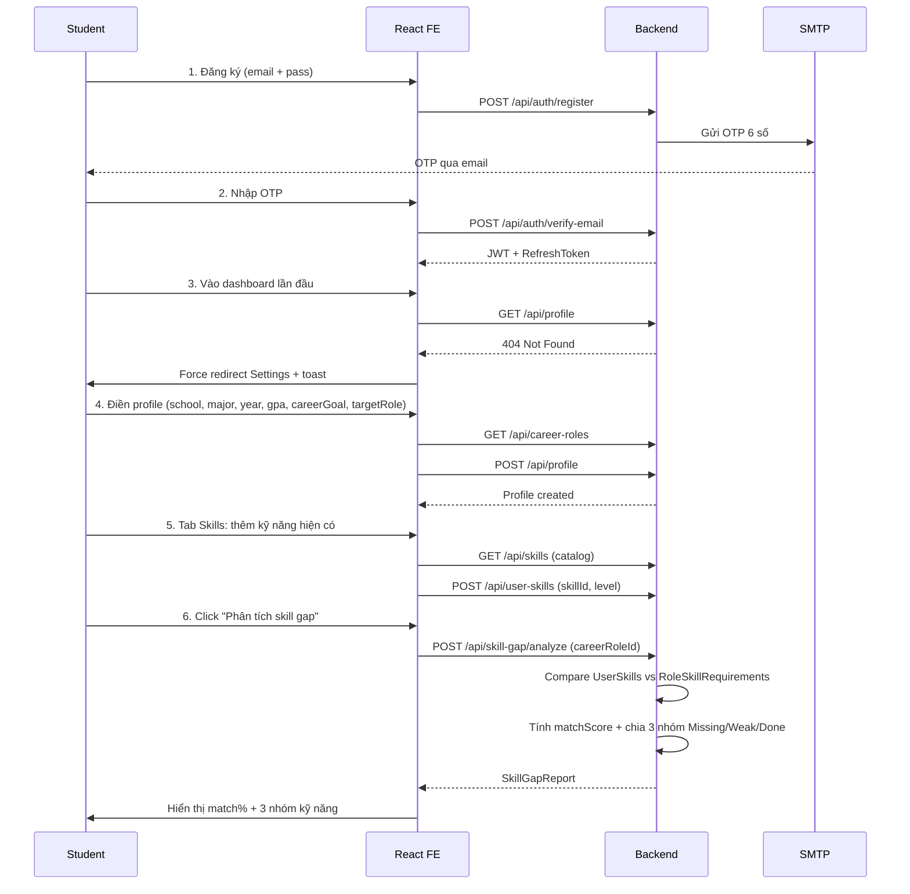
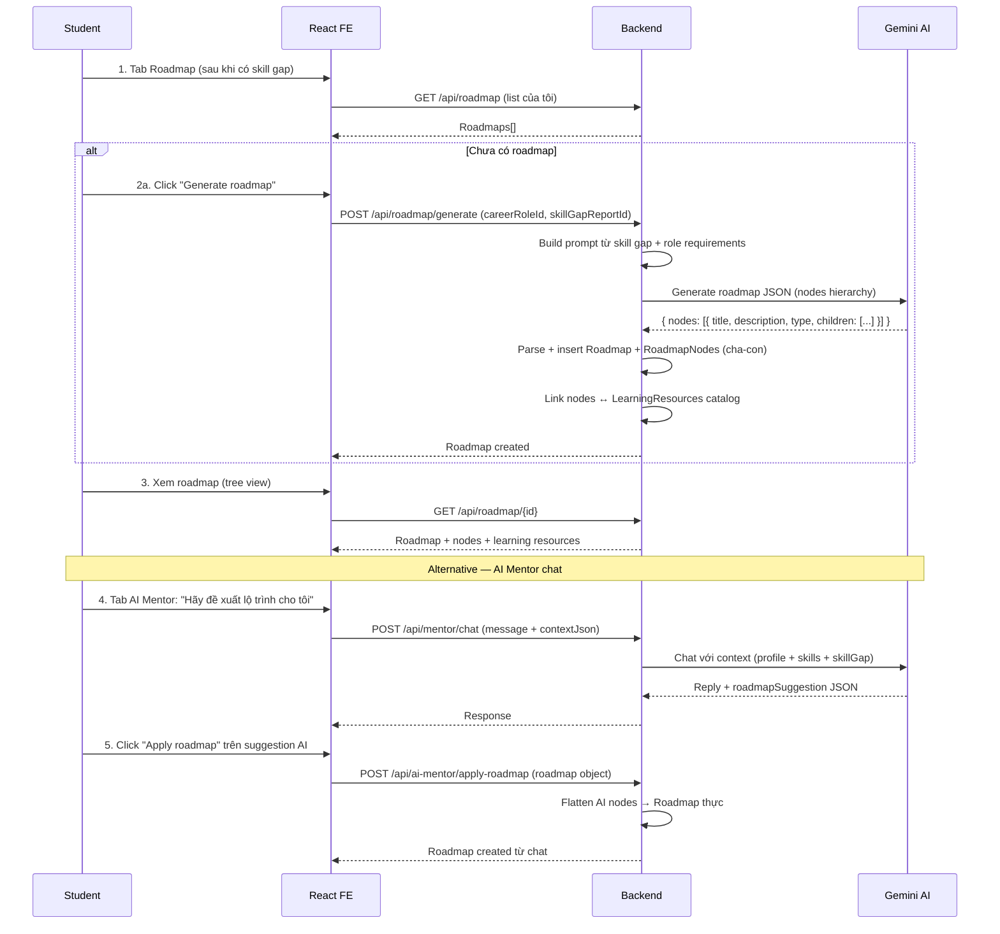
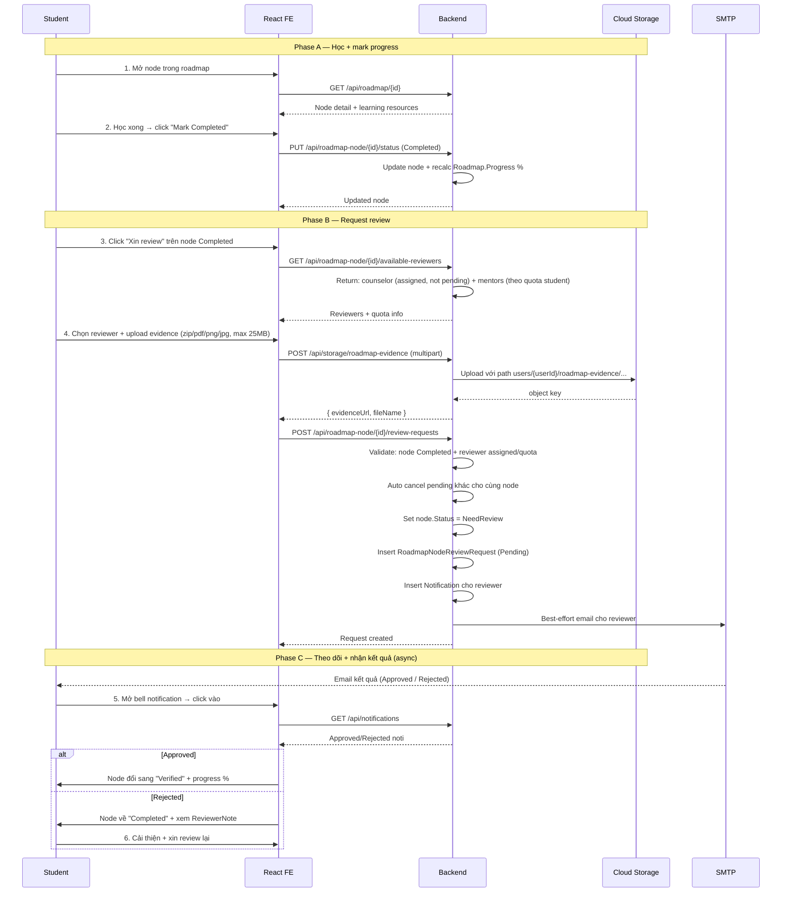
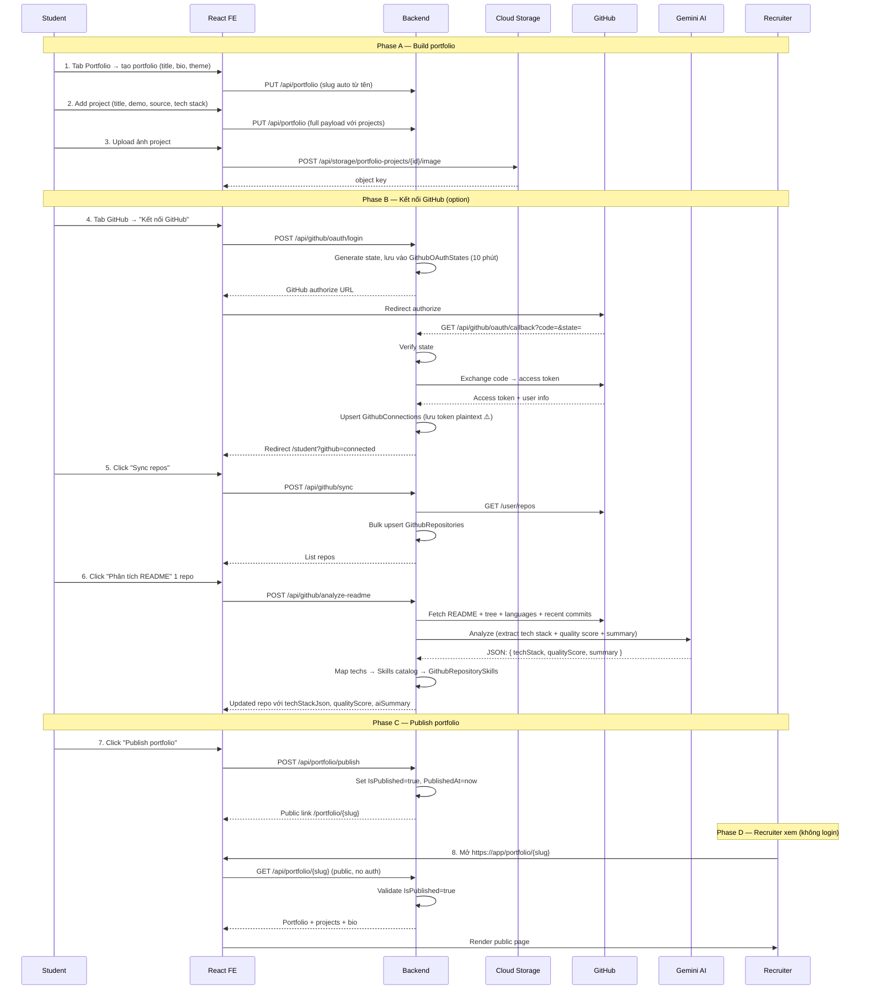
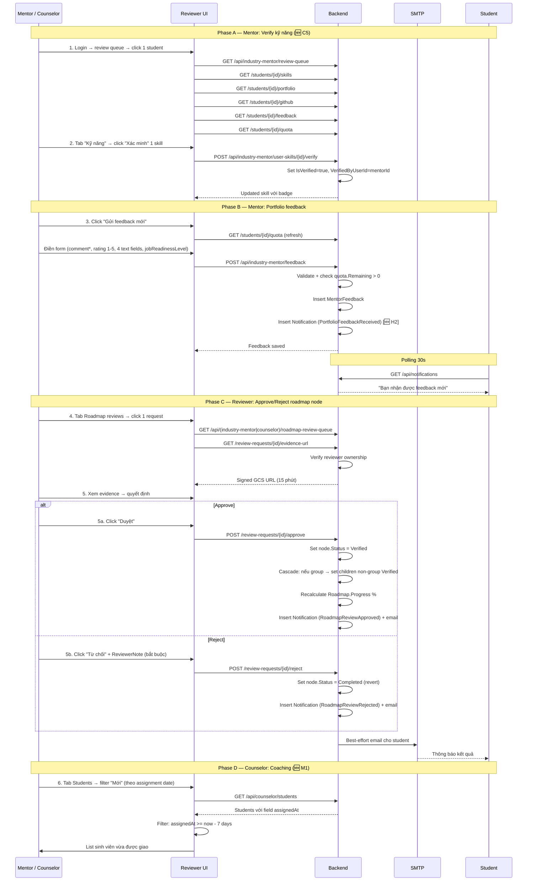
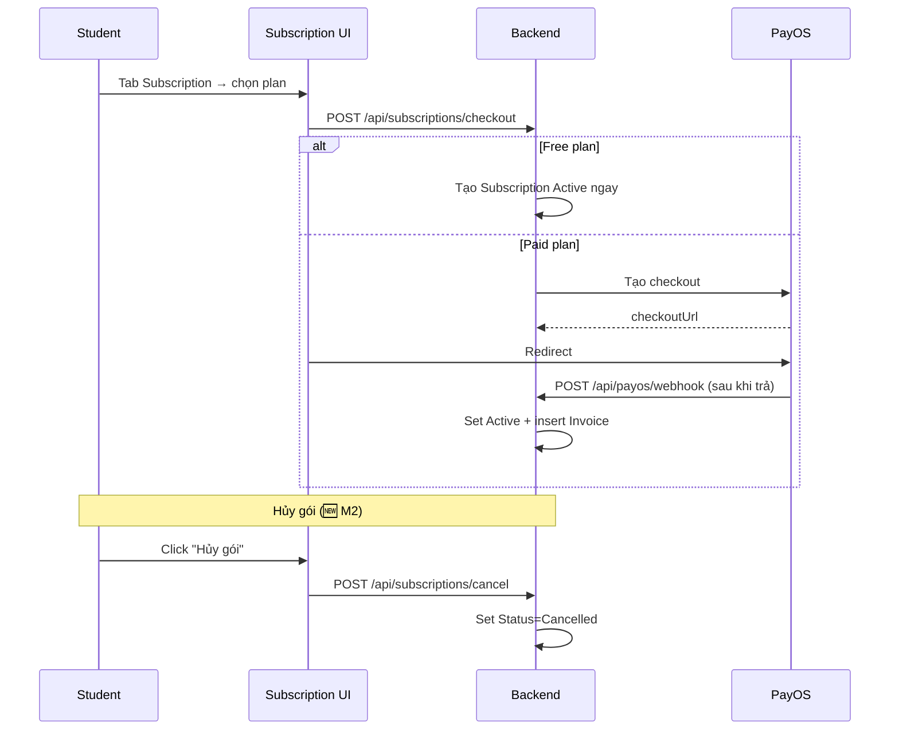

# SWP CareerMap — Full Project Flow Documentation

> Tài liệu mô tả toàn bộ luồng end-to-end và chức năng của dự án **SWP CareerMap** — nền tảng định hướng nghề nghiệp cho sinh viên.

## 1. Tổng quan dự án

**SWP CareerMap** là nền tảng giúp sinh viên CNTT/IT xác định mục tiêu nghề nghiệp, đánh giá khoảng cách kỹ năng (skill gap), tự sinh roadmap học tập với AI, xây portfolio công khai, và nhận review từ chuyên gia (mentor công nghiệp + cố vấn học vụ).

### Stakeholders (4 role)

| Role | Mục tiêu chính |
|---|---|
| **Student** | Khám phá nghề → đánh giá kỹ năng → học theo roadmap → xây portfolio → xin review |
| **Industry Mentor** | Review portfolio + roadmap của student → xác minh kỹ năng → đưa feedback nghề nghiệp |
| **Academic Counselor** | Phụ trách 1 nhóm student → review tiến độ học → đưa feedback học vụ |
| **Admin** | Quản trị users, plans, careers, skills, monitor payment |

---

## 2. Tech Stack



**Hosting:**
- FE: Firebase Hosting (`https://swp-fe-careermap-2026-47ca0.web.app`)
- BE: Google Cloud Run (`asia-southeast1`)
- DB: Cloud SQL Postgres
- Storage: Google Cloud Storage bucket
- Auth: JWT Bearer + Google OAuth + GitHub OAuth + Email OTP

---

## 3. Domain Model (entities chính)

| Entity | Mục đích |
|---|---|
| `User` | Tài khoản (Student/Admin/Counselor/Mentor) |
| `StudentProfile` | school/major/year/gpa/careerGoal/targetRole |
| `CareerRole` | Vai trò nghề (FE Dev, BE Dev, Data, ...) |
| `Skill` | Catalog kỹ năng (React, Python, ...) |
| `RoleSkillRequirement` | Kỹ năng + level cần cho mỗi role |
| `UserSkill` | Kỹ năng student có (level + verified by) |
| `SkillGapReport` | Phân tích match score + missing/weak/done |
| `Roadmap`, `RoadmapNode` | Lộ trình học cá nhân hoá |
| `RoadmapNodeReviewRequest` | Yêu cầu review từng node |
| `MentorFeedback` | Feedback portfolio từ mentor |
| `Portfolio`, `PortfolioProject` | Hồ sơ công khai |
| `GithubConnection`, `GithubRepository` | OAuth + repo synced |
| `MentorSession`, `MentorMessage` | AI Mentor chat |
| `Subscription`, `SubscriptionPlan` | Gói trả phí |
| `PaymentTransaction`, `Invoice` | Thanh toán |
| `CounselorAssignment` | Phân công counselor ↔ student |
| `Notification` | In-app notification |

---

## 4. Tech Architecture

```mermaid
graph TB
    subgraph "Client"
        Web["Web Browser"]
    end
    subgraph "FE - React"
        AuthPage["AuthPage"]
        StudentDash["StudentDashboard"]
        MentorHome["MentorHome"]
        CounselorHome["CounselorHome"]
        AdminDash["AdminDashboard"]
        PublicPortfolio["PublicPortfolioPage"]
    end
    subgraph "BE Controllers"
        Auth["AuthController"]
        Profile["ProfileController"]
        Skills["UserSkillsController"]
        Gap["SkillGapsController"]
        Roadmap["RoadmapController"]
        Review["RoadmapReviewController"]
        Mentor["IndustryMentorController"]
        AiMentor["MentorController"]
        Portfolio["PortfolioController"]
        Github["GithubController"]
        Sub["SubscriptionsController"]
        PayOs["PayOsController"]
        Counselor["CounselorController"]
        Admin["Admin*Controller"]
        Notif["NotificationsController"]
    end
    subgraph "Services"
        QuotaSvc["StudentReviewQuotaService"]
        StorageSvc["GoogleCloudStorageService"]
        EmailSvc["SmtpEmailSender"]
        AISvc["GeminiTextGenerationService"]
        PaymentSvc["PaymentProcessingService"]
    end
    Web --> AuthPage
    AuthPage --> Auth
    StudentDash --> Profile
    StudentDash --> Skills
    StudentDash --> Roadmap
    MentorHome --> Mentor
    CounselorHome --> Counselor
    AdminDash --> Admin
    PublicPortfolio --> Portfolio
    Mentor --> QuotaSvc
    Review --> QuotaSvc
    Roadmap --> AISvc
    AiMentor --> AISvc
    PayOs --> PaymentSvc
```



---

## 5. Năm luồng End-to-End chính (nghiệp vụ cốt lõi)

5 luồng này phản ánh **hành trình nghiệp vụ** chính của sản phẩm — từ lúc sinh viên khám phá nghề đến lúc được chuyên gia xác minh năng lực.
Subscription/Payment và Admin operations xem ở [Section 6 — Luồng hỗ trợ](#6-luồng-hỗ-trợ-không-phải-nghiệp-vụ-chính).

```
Flow 1: Discovery   → "Tôi muốn làm nghề gì? Tôi đang ở đâu?"
Flow 2: Planning    → "Tôi cần học những gì để đến đích?"
Flow 3: Execution   → "Tôi học + làm bài + xin xác nhận tiến độ"
Flow 4: Showcase    → "Tôi trình bày thành quả cho thế giới xem"
Flow 5: Validation  → "Chuyên gia review + xác minh năng lực của tôi"
```

---

### 🎯 Flow 1 — DISCOVERY: Onboarding & Skill Gap Analysis

> **Vai trò:** Student | **Trả lời câu hỏi:** "Tôi muốn làm nghề gì, hiện tại tôi đang thiếu gì?"



**Logic tính match score:**
```
For each requirement (skill, requiredLevel, weight):
  Matched + verified  → weight × 1.0
  Matched, unverified → weight × 0.5
  Weak (level thấp hơn)  → weight × (userLevel / requiredLevel)
  Missing             → weight × 0
matchScore = sum / totalWeight × 100
```

**Đầu vào đầu ra:**
- Input: 1 student với profile + n kỹ năng + 1 target career role
- Output: 1 SkillGapReport với matchScore (%) + danh sách SkillGapReportItem (status: Matched/Weak/Missing)

**Đơn vị đo thành công:** Student nìn rõ "tôi còn thiếu n kỹ năng để đến nghề X".

---

### 🎯 Flow 2 — PLANNING: AI Roadmap Generation

> **Vai trò:** Student | **Trả lời:** "Học những gì, theo thứ tự nào để đạt target?"



**3 nguồn sinh roadmap:**
1. **From skill gap:** Auto generate từ gap report + role requirements (được dùng nhất)
2. **From AI chat:** Hiểu yêu cầu đặc biệt qua chat → apply
3. **Fallback:** Nếu skill gap rỗng + AI fail → nodes mẫu theo career role

**Cấu trúc roadmap:**
```
Roadmap (1 sinh viên × 1 target role)
  ├─ Group node "Frontend Foundation"
  │    ├─ Leaf node "HTML5 semán"
  │    ├─ Leaf node "CSS Flexbox"
  │    └─ Leaf node "JS ES6+"
  ├─ Group node "React Mastery"
  │    ├─ Leaf node "Hooks"
  │    ├─ Leaf node "Routing"
  │    └─ Leaf node "State management"
  └─ Group node "Testing"
```

Mỗi node có:
- `status`: Pending → InProgress → Completed → NeedReview → Verified
- `description` (markdown)
- `learningResources[]` (link bài học)
- `nodeType`: Group | Leaf

---

### 🎯 Flow 3 — EXECUTION: Learning Loop + Review Request

> **Vai trò:** Student | **Trả lời:** "Tôi học, làm bài, sau đó xin chuyên gia xác nhận tôi đã thuần thục"



**Đặc điểm của evidence:**
- File types: zip (code), pdf (báo cáo), png/jpg (screenshot demo)
- Max size: 25 MB (Cloud Run env `Storage__MaxUploadBytes=26214400`)
- Lưu ở GCS bucket với path scope theo userId → reviewer phải request signed URL mới xem được (15 phút)
- Nếu evidence là GitHub repo URL: không upload, chỉ lưu link

**Quy tắc chọn reviewer:**
- **Counselor:** phải đã được admin assign cho student (qua `CounselorAssignment`)
- **Mentor:** student phải còn quota (theo plan), mentor này chưa có pending request cho cùng node

**Cascade verify khi approve group node:**
```
Group approved → set tất cả children non-group:
  status Completed → Verified
Nếu child là Group: ko cascade sâu hơn (mentor phải approve từng group)
```

---

### 🎯 Flow 4 — SHOWCASE: Portfolio + GitHub + AI Mentor

> **Vai trò:** Student | **Trả lời:** "Tôi trình bày thành quả — ai cũng xem được, kể cả nhà tuyển dụng không có tài khoản"



**Thiết kế của Public Portfolio Page:**
- URL pattern: `/portfolio/{slug}` (vd `/portfolio/nguyen-van-a-fe-dev`)
- Slug auto generate từ fullName (Vietnamese normalize), unique trong DB
- KHÔNG cần login — BE có endpoint public riêng
- 3 themes hả -coded FE: modern / dark / minimal
- Có thể share link trực tiếp trên LinkedIn / CV

**Vai trò GitHub trong showcase:**
- Repos sync về → mentor xem khi review
- AI analyze README → tự động map ra Skills catalog → bổ sung profile
- Portfolio projects có thể link tới GitHub repo

---

### 🎯 Flow 5 — VALIDATION: Mentor + Counselor verify năng lực

> **Vai trò:** Industry Mentor + Academic Counselor | **Trả lời:** "Tôi xác minh sinh viên thực sự có kỹ năng và đưa feedback chuyên sâu"



**Mức độ "validation" tăng dần:**
```
Mark Completed (self)             → status: Completed
Reviewer Approved roadmap node    → status: Verified
Mentor verify skill trực tiếp     → UserSkill.IsVerified = true
Mentor portfolio feedback         → jobReadinessLevel: NotReady/.../Excellent
```

**Quota mentor (sau fix C4):**
- Chỉ mentor có quota, counselor không giới hạn
- Quota thuộc về STUDENT (người mua plan), không phải mentor
- Used = portfolio feedback + roadmap approve trong period sub
- Limit đọc từ `Plan.FeaturesJson.mentorReviewLimit` (fallback 2)

---

## 6. Luồng hỗ trợ (không phải nghiệp vụ chính)

### S1 — Subscription & Payment (PayOS)

Không phải flow nghiệp vụ chính, chỉ là paywall để student mở thêm quota.



### S2 — Admin operations

```
Admin login
  ├─ Users CRUD + search (🆕 M3) + role assign
  ├─ Career roles CRUD (soft delete)
  ├─ Skills catalog CRUD
  ├─ Subscription plans CRUD + FeaturesJson
  ├─ Counselor assignments
  ├─ Payment transactions/subscriptions/invoices view + manual status override
  └─ Stats dashboard (KPI + 4 charts)
```

Không phải luồng nghiệp vụ cần mỗi ngày — chỉ setup + monitoring.

### S3 — Notification system

Cross-cutting: mỗi action quan trọng → tạo `Notification` row → user xem qua bell (polling 30s).

```
Event                          → Notification
RoadmapReviewRequested         → reviewer
RoadmapReviewApproved/Rejected → student
PortfolioFeedbackReceived (🆕) → student
```

---

## 7. Tính năng theo role (Feature Matrix)

### Student

| Module | Feature |
|---|---|
| Auth | Đăng ký + verify OTP, login pwd, login Google, logout, forgot password (chưa có UI) |
| Profile | Tạo/sửa, upload avatar, redirect onboarding lần đầu |
| Skills | CRUD skill cá nhân, upload evidence file |
| Skill Gap | Phân tích match score theo target role, view 3 nhóm Missing/Weak/Done |
| Roadmap | Generate AI roadmap từ skill gap, mark progress, request review |
| Review request | Upload evidence, chọn reviewer, cancel request |
| AI Mentor | Chat với context profile + skill, apply AI roadmap |
| Portfolio | Tạo, theme, projects, upload ảnh, publish, public route /portfolio/{slug} |
| GitHub | OAuth connect, sync repos, AI analyze README → tech stack + skills |
| Subscription | Mua gói qua PayOS, free plan, 🆕 cancel sub |
| Notification | In-app bell với polling 30s |

### Industry Mentor

| Module | Feature |
|---|---|
| Auth | Login + dashboard |
| Review queue | List students có portfolio publish |
| Student detail | Portfolio panel + GitHub panel + 🆕 Skills panel + Feedback history |
| 🆕 Skill verify | Verify/un-verify skill (chỉ verifier gốc rút) |
| Portfolio feedback | Form structured (rating, 4 trường text, jobReadinessLevel) |
| Roadmap review | Approve/reject với evidence preview, signed URL |
| Quota widget | Remaining/Limit/PlanName per student |
| Notification | Bell với polling |

### Academic Counselor

| Module | Feature |
|---|---|
| Auth | Login + dashboard |
| Students | List students được phân công, 🆕 filter "Mới" theo assignment date |
| Student detail | Profile + skill gap + roadmap |
| Roadmap review | Approve/reject (không quota) |
| Counselor feedback | Skill gap report feedback |
| Notification | Bell với polling |

### Admin

| Module | Feature |
|---|---|
| Auth | Login + dashboard |
| Users | CRUD users, set role, soft delete, upload avatar, 🆕 search bar |
| Career roles | CRUD (delete = soft via IsActive) |
| Skills catalog | CRUD |
| Plans | CRUD subscription plans + features JSON |
| Payments | View transactions/subscriptions/invoices, manual status override |
| Stats | KPI tiles + 4 charts (new users, subs, revenue, learning resources) |
| Counselor assignments | Phân công counselor ↔ students |

---

## 8. Quyền truy cập (Authorization Matrix)

```
[Authorize] → bất kỳ user đã login
[Authorize(Roles="Student")]
[Authorize(Roles="IndustryMentor")]
[Authorize(Roles="AcademicCounselor")]
[Authorize(Roles="Admin")]
[Authorize(Roles="Admin,IndustryMentor,AcademicCounselor")] → reviewer chung
```

| Endpoint pattern | Allowed roles |
|---|---|
| `/api/auth/*` | Public |
| `/api/profile`, `/api/user-skills/*`, `/api/skill-gap/*` | Student (CRUD của chính mình) |
| `/api/roadmap*` | Student (own) |
| `/api/portfolio/*` GET | Student (own); public cho `/api/portfolio/{slug}` |
| `/api/github/*` | Student (own) |
| `/api/subscriptions/*` | Bất kỳ user đã login |
| `/api/industry-mentor/*` | IndustryMentor only |
| `/api/counselor/*` | AcademicCounselor only |
| `/api/roadmap-node/review-requests/{id}/(approve\|reject)` | Mentor + Counselor + Admin |
| `/api/admin/*` | Admin only |
| `/api/notifications/*` | Bất kỳ (per-user) |

---

## 9. Bước thực hiện chi tiết — Setup Local Dev

```bash
# 1. Clone
git clone https://github.com/truong14042004/SWP-BE.git
git clone https://github.com/truong14042004/SWP-FE.git

# 2. BE
cd SWP-BE
# - Tạo appsettings.Development.json copy từ appsettings.json
# - Đổi ConnectionString về DB local
dotnet restore
dotnet ef database update
dotnet run                 # http://localhost:5000

# 3. FE
cd SWP-FE
npm install
# - Tạo .env.local: VITE_API_URL=http://localhost:5000
npm run dev                # http://localhost:5173

# 4. Test
# - Tạo seed data qua admin (POST /api/admin/users) hoặc Postgres
# - Login với admin trước, sau đó tạo student/mentor/counselor
```

### Bước deploy production

```bash
# BE
cd SWP-BE
gcloud builds submit --config cloudbuild.yaml
# Cloud Run sẽ build container + deploy

# FE
cd SWP-FE
npm run build
npx firebase deploy --only hosting
```

---

## 10. Workflow user thực tế (5 use cases)

### Use case 1 — Sinh viên FPT muốn theo Frontend
```
Đăng ký → OTP → điền profile (FPT, IT, năm 3, GPA 3.2, "FE Dev")
→ chọn target role "Frontend Developer"
→ thêm skills (HTML, CSS, JS Beginner)
→ Phân tích skill gap → match 35% (thiếu React, TypeScript, Testing)
→ Generate roadmap 12 nodes
→ Học 2 tuần → mark 4 nodes Completed
→ Xin counselor review tiến độ → counselor approve
→ Build 2 projects portfolio (React app + landing page)
→ Publish portfolio → share link cho recruiter
```

### Use case 2 — Mentor công nghiệp đánh giá fresher
```
Mentor login → review queue
→ Click student "Trần Văn A" có portfolio mới publish
→ Xem 3 projects + 5 GitHub repos + 8 kỹ năng
→ Tab Kỹ năng: verify "React Advanced" + "Git Intermediate" (đã thấy code thực tế)
→ Click "Gửi feedback" → rating 4/5, jobReadinessLevel="NeedsImprovement"
→ Recommendations: "Học thêm testing với Jest"
→ Submit
→ Student nhận noti + email + thấy feedback trong dashboard
```

### Use case 3 — Counselor phụ trách 30 sinh viên
```
Counselor login → tab Students
→ Filter "Mới" → thấy 5 student vừa được phân tuần này
→ Click student "Lê Thị B" → xem skill gap (match 42%)
→ Tab Roadmap reviews → 1 request pending từ B
→ Mở evidence (zip code) → 15 phút signed URL
→ Approve với note "Code structure tốt, tiếp tục"
→ B nhận noti + node "Build TODO app" chuyển Verified
→ Roadmap progress của B tăng từ 33% lên 41%
```

### Use case 4 — Student mua Pro plan
```
Student dùng free plan: hết 2 lượt mentor review
→ Tab Subscription → click "Mua Pro" (200k VND/tháng, 10 lượt)
→ Redirect PayOS → quét QR ngân hàng
→ Thanh toán xong → PayOS gọi webhook → BE set Active
→ Redirect về /payment/success → poll /me → thấy Active
→ Quay lại tab xin review → thấy 10 lượt mới
→ 1 tháng sau muốn dừng → click "Hủy gói" (M2 mới)
→ Confirm → status Cancelled
```

### Use case 5 — Admin onboard mentor mới
```
Admin login → Users section
→ Search "ngoc.mentor" → không thấy
→ Click "New user" → điền: email, fullName, role=IndustryMentor, isActive=true
→ Save → user mới được tạo với password mặc định
→ Báo password cho mentor qua email/messenger
→ Mentor login → đổi password (khi có UI)
→ Admin sang section Plans → tạo gói mới "Premium 500k VND, 30 reviews/tháng, FeaturesJson={mentorReviewLimit:30}"
→ Save → student mua gói mới sẽ có 30 lượt review
```

---

## 11. Trạng thái hiện tại (sau audit + fix)

### ✅ Đã fix (sprint hiện tại)

| Issue | Mô tả |
|---|---|
| C4 | Mentor quota — parse FeaturesJson + count cả roadmap approve |
| C5 | UI verify skill cho mentor (tab "Kỹ năng" + verify/unverify) |
| C6 | Quyết định business: quota là per-student, mentor không subscribe |
| H2 | Notification cho student khi nhận portfolio feedback |
| M1 | Counselor filter "Mới" dùng AssignmentDate thay User.CreatedAt |
| M2 | Cancel subscription UI cho student |
| M3 | Search bar admin UsersView |

### ⏳ Backlog

| Severity | Issue |
|---|---|
| 🔴 | C2 — Rotate secrets (cần làm dashboard) |
| 🟠 | JWT auto-refresh khi 401 |
| 🟠 | Encrypt GitHub access token (plaintext trong DB) |
| 🟠 | Race condition khi 2 reviewer cùng approve |
| 🟡 | Pagination queues (mentor + counselor) |
| 🟡 | CV upload cho AI Mentor |
| 🟡 | Admin notification broadcast |
| 🟡 | Mentor approval flow (chỉ admin tạo trực tiếp) |
| 🟡 | Settings UI admin |

### 📊 Coverage

- 4 role × ~10 flow chính = **~40 user journey** đã wired đầy đủ FE→BE→DB
- 0 mock data còn sót lại (đã verify qua audit)
- ~80 endpoint thật chạy trên Cloud Run

---

## 12. Reference

### Repos
- BE: https://github.com/truong14042004/SWP-BE
- FE: https://github.com/truong14042004/SWP-FE

### Production
- FE: https://swp-fe-careermap-2026-47ca0.web.app
- BE: Cloud Run asia-southeast1 (URL trong env vars)

### Audit reports
- [E2E audit all roles](file:///C:/Users/Truong/.gemini/antigravity/brain/ebdf7ab5-c4e6-4b54-b638-1bb36c53cb2b/e2e_audit_all_roles.md)
- [E2E flows initial](file:///C:/Users/Truong/.gemini/antigravity/brain/ebdf7ab5-c4e6-4b54-b638-1bb36c53cb2b/e2e_flows.md)
